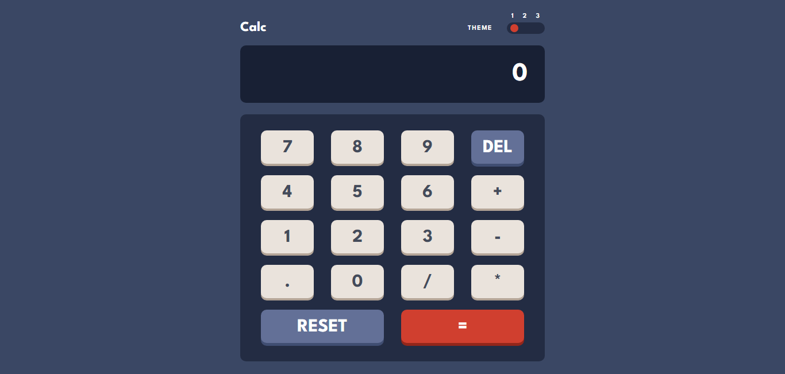
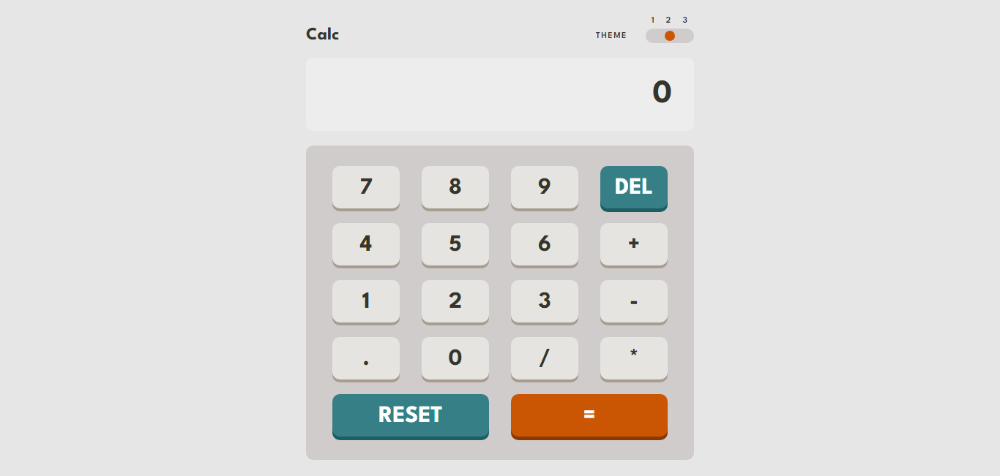
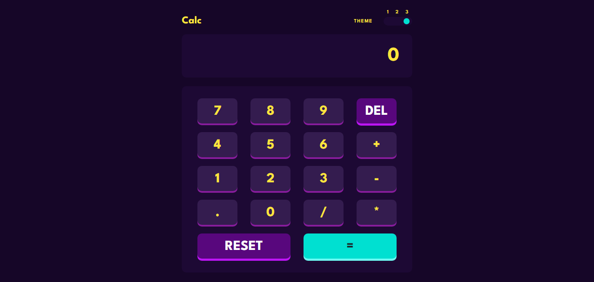

# Calculator App 

Calculator App is a simple and minimalist web application for a calculator. It allows users to perform basic arithmetic operations such as addition, subtraction, multiplication, and division accurately and precisely.

## Features

- Perform addition, subtraction, multiplication, and division effortlessly.
- Minimalist interface for smooth user experience.
- Built with React.js and Vite for efficient development.
- SCSS (Sass) utilized for customizable interface colors.

## Screenshot

Link to visit the web calculator by netlify: https://calculator-app-repository.netlify.app/

Feel free to explore the codebase and contribute to the project's growth and improvement. Happy calculating!!!👋👋
